# 巡云轻论坛 Spring Boot 4.x 版本  
##  前台电脑版前端请移步至 [https://gitee.com/diyhi/bbs-web-pc-jdk21 ](https://gitee.com/diyhi/bbs-web-pc-jdk21 )
##  管理后台前端请移步至 [https://gitee.com/diyhi/bbs-web-admin-jdk21](https://gitee.com/diyhi/bbs-web-admin-jdk21 ) 
 

#### 项目介绍
巡云轻论坛是一款基于 JDK21 + Spring Boot 4.x 构建的现代社区系统，采用前后端分离架构，完美适配移动端与 PC 端。系统集成论坛与问答模块。针对高频访问数据表引入分表存储策略，有效解决单表性能瓶颈。

  
  

#### 技术选型
Spring Boot 4.x + JPA + Ehcache + Lucene

#### 使用平台
JDK 21及以上 + MySQL 5.7及以上

  

官方网站：[https://www.diyhi.com/](https://www.diyhi.com/)

演示网站：[https://www.diyhi.com/cms.html](https://www.diyhi.com/cms.html) 页面可获取前后台演示地址、登录账号和密码

服务器部署参考：[https://www.diyhi.com/article-15.html](https://www.diyhi.com/article-15.html)

  
#### 源码运行教程

1、将源代码导入到 IDEA 中(基于Maven)

2、修改配置文件:修改项目下`src\main\resources\application.yml`文件，请自行替换数据库信息 
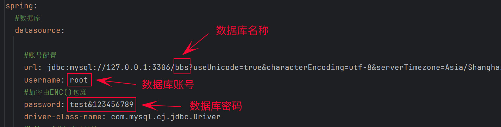

3、点击右上角‘Maven’按钮 --> 打开面板后点击左上角的“刷新”图标 --> 同步所有 Maven 项目，重新加载依赖 
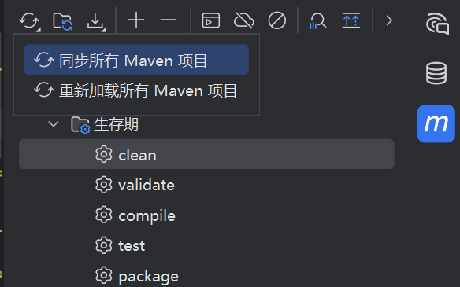

4、在IDEA中打开src\test\java\cms\Init.java --> 选中install()方法右键选择`运行install()`，此操作会创建外部文件夹并将SQL导入到数据库 
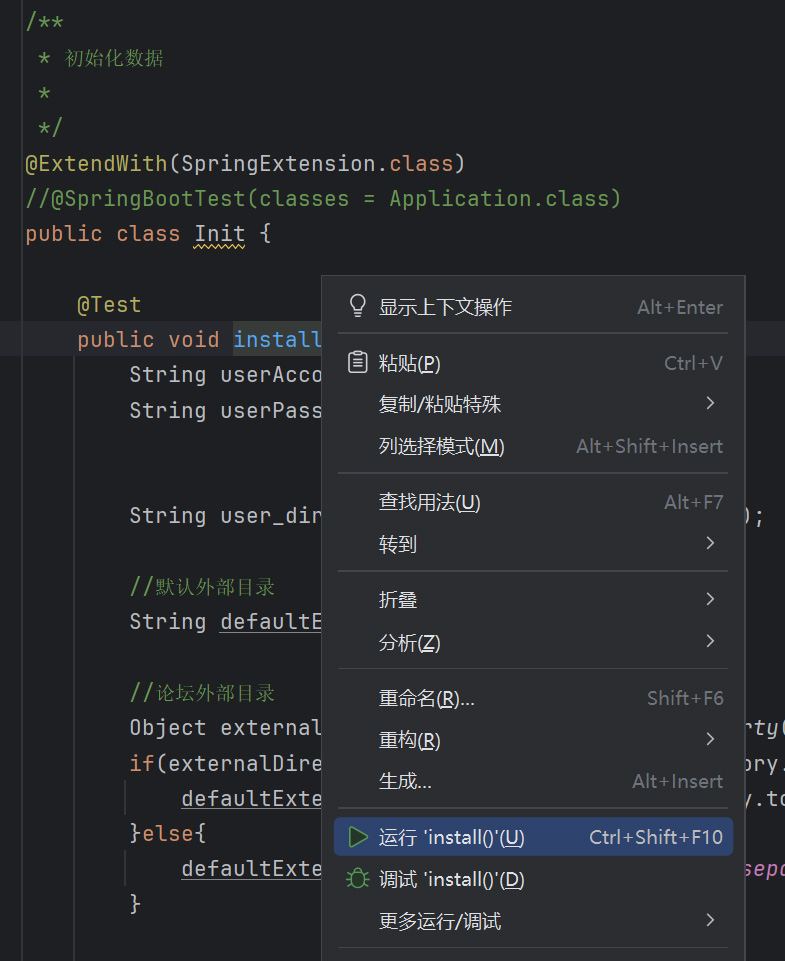

5、然后启动项目即可正常运行。 
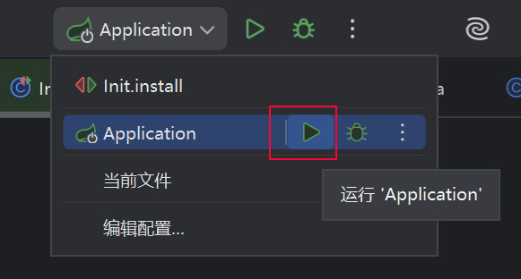
  
将后端地址`http://您的地址:8080/`填写到前端`.env.development`、`.env.production`中，管理后台地址为 http://您的地址:3000/admin/login  
管理员初始账号admin 密码1234567(可自行修改)

  
  
#### 使用限制

本轻论坛项目禁止在商业上使用。
  
    
  
#### 主要功能
（1）话题（发表话题、编辑话题、发表评论、编辑评论、删除评论、发表回复、编辑回复、删除回复、审核话题、审核评论、审核回复、搜索话题

、收藏、点赞、上传视频、话题输入密码可见、话题评论可见、话题达到等级可见、话题支付积分可见、话题支付现金可见、

、标签设置角色、红包）

（2）问答（发表问题、追加问题、发表答案、编辑答案、发表回复、编辑回复、审核问题、审核答案、审核回复、搜索问题

、悬赏现金、悬赏积分、收藏、设置最佳答案）

（3）会员（会员等级、会员注册项、会员角色、会员注册禁止用户名称、会员搜索、登录日志、更换头像、私信、系统通知

、提醒、收藏夹、点赞、关注、粉丝、微信登录）

（4）员工管理(员工列表、角色列表、登录日志)

（5）会员卡管理(会员卡列表、会员卡订单)

（6）前台模块管理（API列表、前台文档列表、站点栏目）

（7）在线帮助管理（在线帮助分类、合并分类、在线帮助列表）

（8）浏览量管理(浏览量列表)

（9）友情链接管理(友情链接列表)

（10）留言管理（留言列表）

（11）文件打包管理(压缩文件列表、打包文件)

（12）系统通知管理(系统通知列表)

（13）平台收益管理(解锁话题隐藏内容分成、问答悬赏平台分成)

（14）全站设置(基本设置、维护数据、敏感词、数据库备份/还原、服务器节点参数、升级)

（15）支付管理(在线支付接口)

（16）短信管理(短信接口列表、短信发送错误日志)

（17）第三方服务管理(第三方登录接口列表)

（18）缩略图管理(缩略图列表)

      

  

#### 前端界面(电脑版)
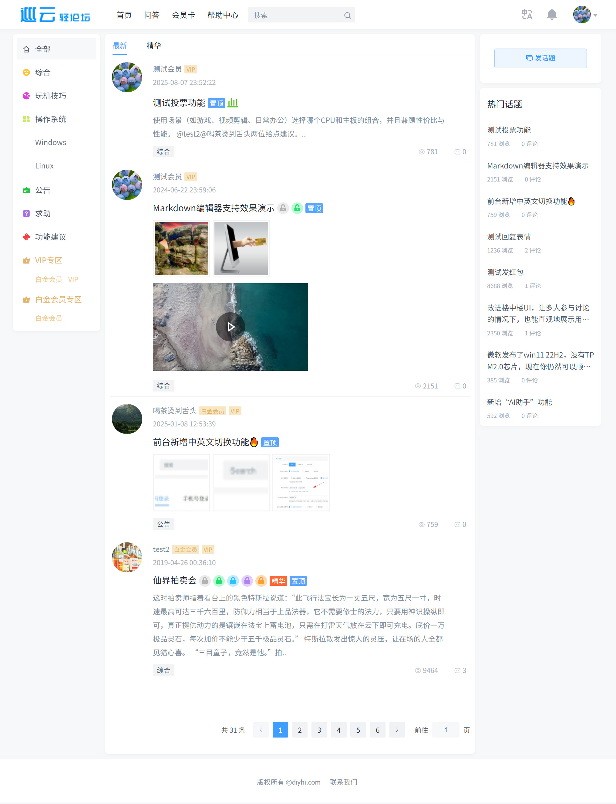
  

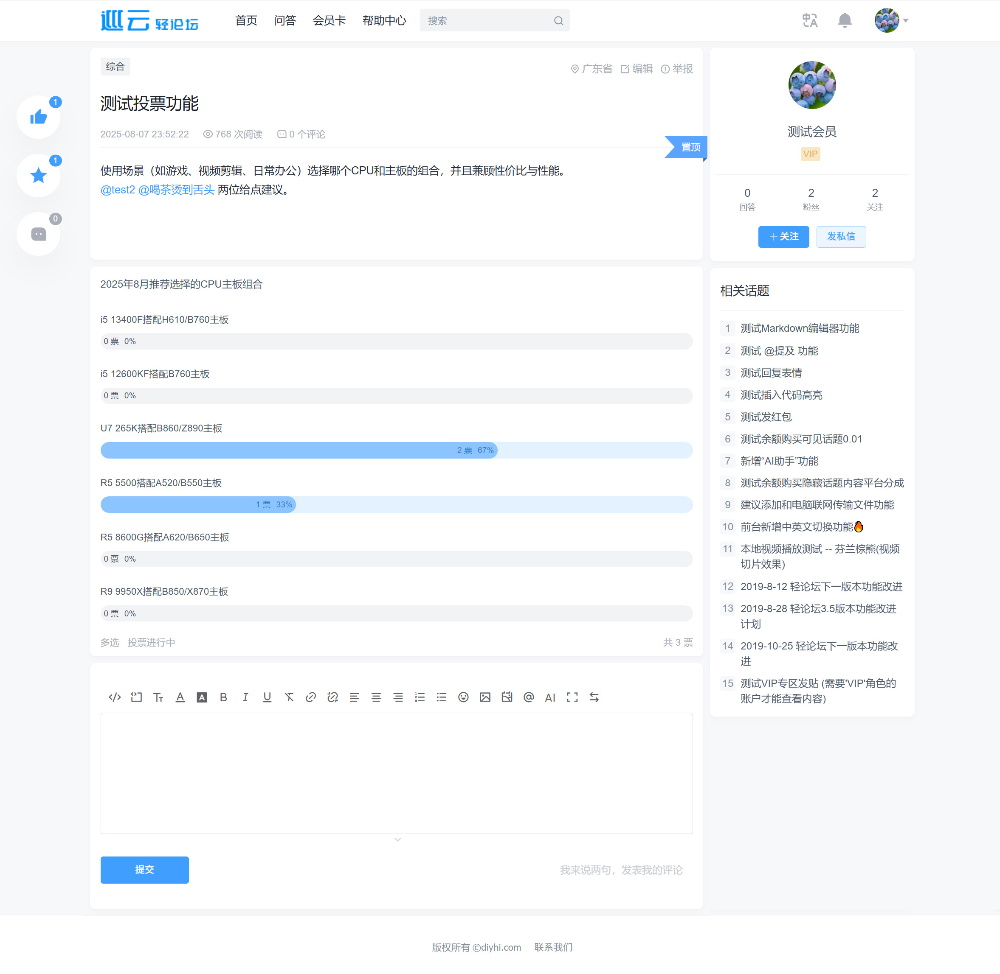
  

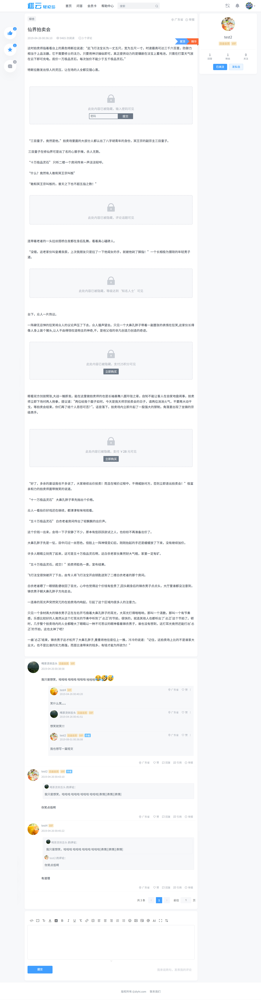
  
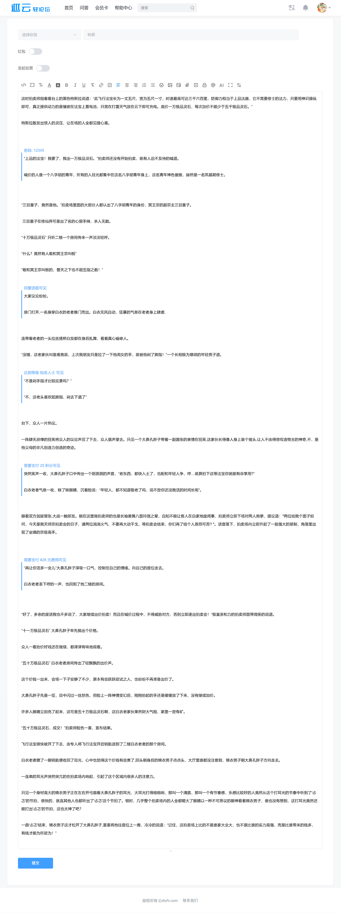
  
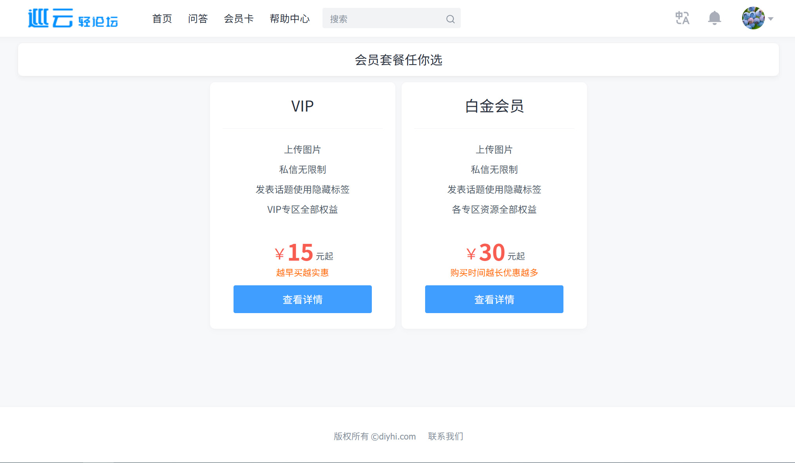
  
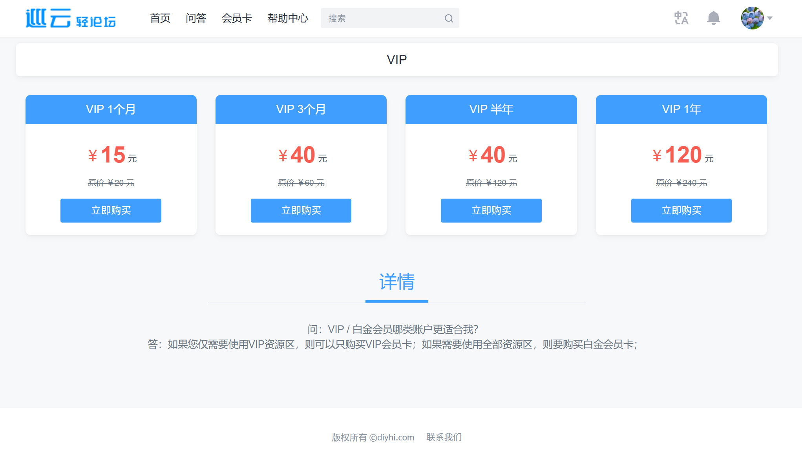
  
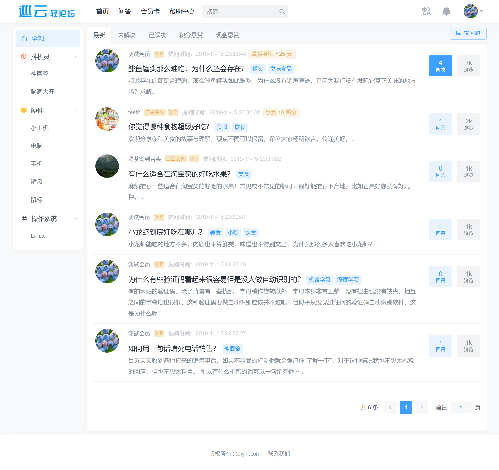
  
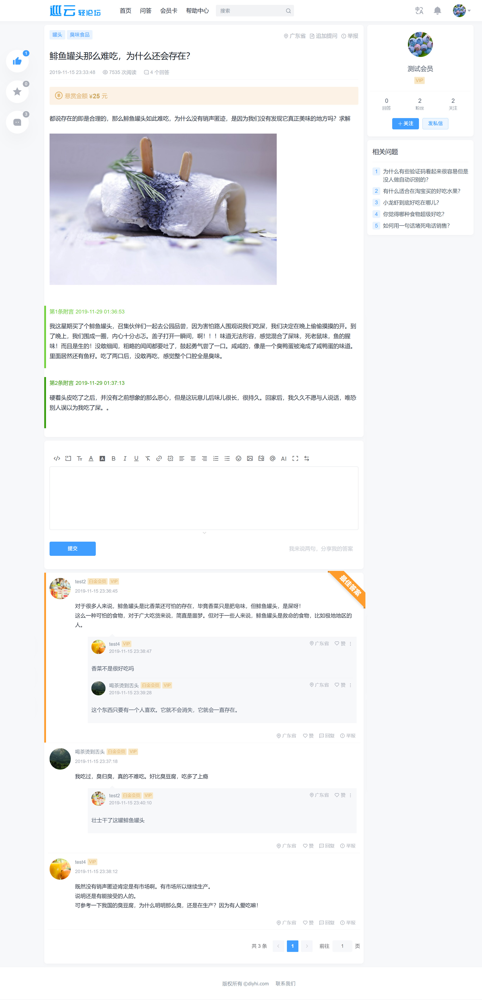
   

#### 前端界面(手机版)
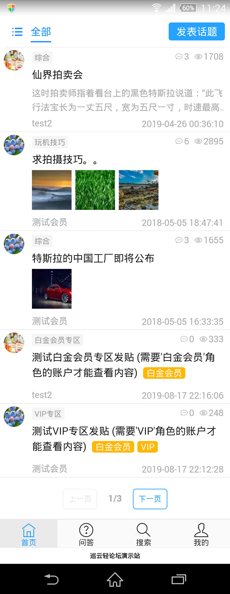

  

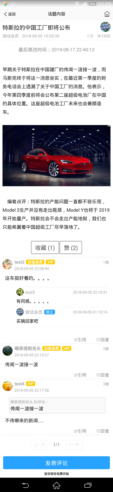

  
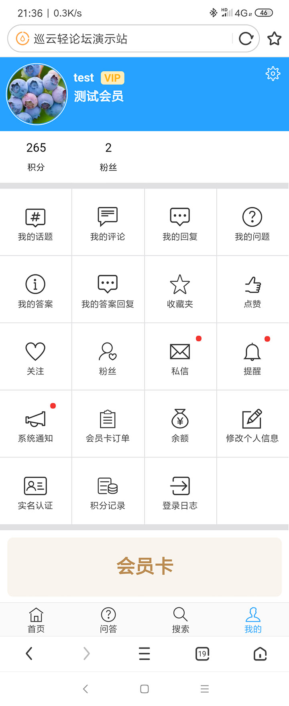
  

